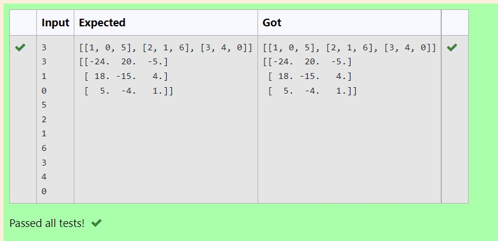

# Inverse-of-matrix

## AIM:
To write a python program for inverse of matrix.
## ALGORITHM:
### Step 1:
import numpy module
### Step 2:
create empty list
### Step 3:
get the value of matrix from the user using nested for loop and append it to a empty list
### Step 4:
using inv() function find the inv of matrix
### Step 5:
Display the inverse of matrix using print() function
## PROGRAM:
import numpy as np
no_of_col,no_of_row=int(input()),int(input())
l1,l2=[],[]
for i in range(no_of_row):
    for j in range(no_of_col):
        l1.append(int(input()))
    l2.append(l1)
    l1=[]
print(l2)
inv=np.linalg.inv(l2)
print(inv)
## OUTPUT:

## RESULT:
Thus the program is written to find the inverse of matrix.